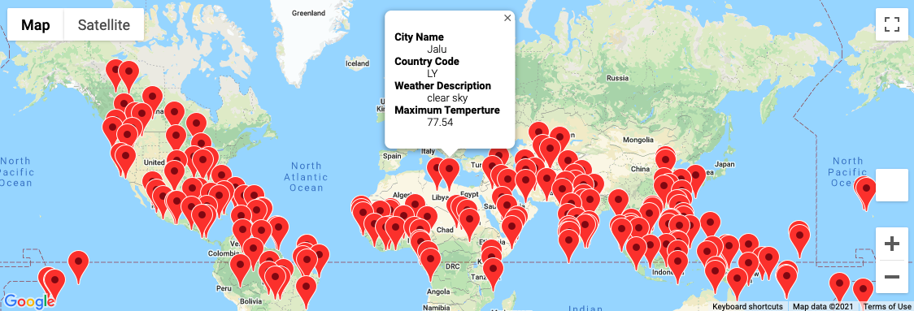
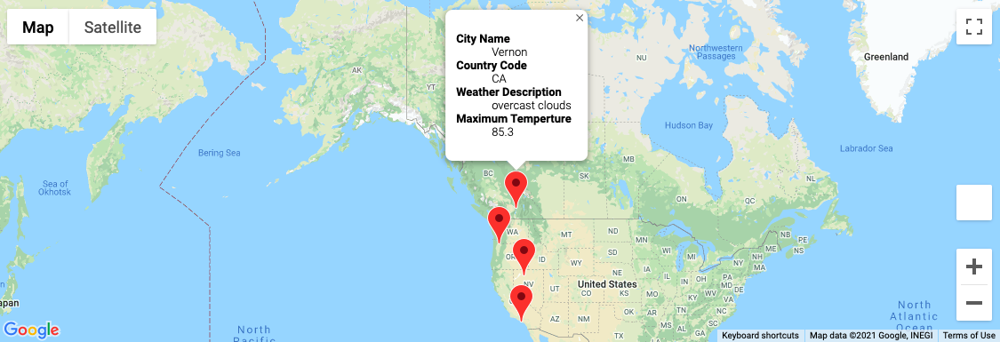

# World_Weather_Analysis

## Overview of Project

The purpose of the project is to update the beta version of the PlanMyTrip app. The updates are based on the recommendations given by the beta testers. The three changes include: 

1. Retrieving the Weather Data
2. Creating a Customer Travel Destinations Map
3. Creating a Travel Itinerary Map

## Results

The data preparation utilizes Python, Pandas and APIs to create DataFrames and maps. 

### Retrieve the Weather Data

This database is used to generate 2,000 random longitudes and latitudes. Using these location points and the OpenWeatherMap API, the database will find the closest cities and its current weather data. 

Insight are generated on the <a href="Weather_Database/Weather_Database.ipynb">Weather Database</a> and the results are produced on <a href="Weather_Database/WeatherPy_Database.csv">Weather Database CSV file</a>. 

### Create a Customer Travel Desctination Map

This database is used to retrieve customers weather preferences and use that data to identify potential travel destinations and hotels. The output will be delivered in a CSV file and a map with pop-up markers. 

In this specific test, the minimum temperature is 75 degrees and maximum temperature is 90. 

Insight are generated on the <a href="Vacation_Search/Vacation_Search.ipynb">Vacation Search Database</a> and the results are produced on <a href="Vacation_Search/WeatherPy_vacation.csv">Vacation Search CSV file</a>. 

This is a sample of what the map will look like: 

### Create a Travel Itinerary Map

This database is utilizing the Google Directions API to create a travel itinerary. It will show the routes between four cities chosen from the customer's possible travel destinations. The output will be delivered on a map with pop-up markers for each city on the itinerary. 

Insight are generated on the <a href="Vacation_Itinerary/Vacation_Itinerary.ipynb">Vacation Itinerary Database</a>.

This is a sample of what the map will look like: 

